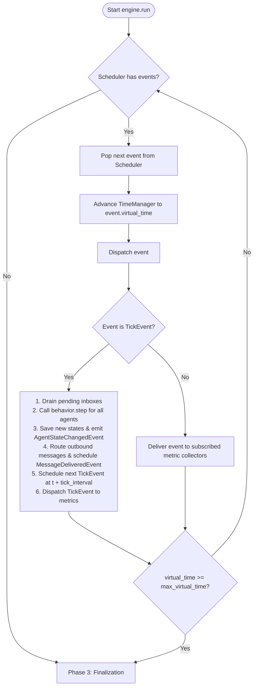

# Simul8: Extended Documentation & Developer Guide

Welcome to the extended documentation for **Simul8**, a research-grade, event-driven, multi-agent simulation platform designed for distributed systems research (e.g., gossip learning, SDN routing, cell automata, consensus protocols).

This document provides a detailed breakdown of how Simul8 works under the hood, how to run experiments, and how to extend the platform by writing custom plugins.

---

## Table of Contents

1. [High-Level Architecture](#1-high-level-architecture)
2. [Core Simulator Components](#2-core-simulator-components)
3. [The Simulation Lifecycle & Loop](#3-the-simulation-lifecycle--loop)
4. [Determinism and Reproducibility](#4-determinism-and-reproducibility)
5. [User Guide: Running Experiments](#5-user-guide-running-experiments)
6. [Developer Guide: Extending Simul8](#6-developer-guide-extending-simul8)
7. [Case Study: Gossip Convergence walkthrough](#7-case-study-gossip-convergence-walkthrough)
8. [Future Scaling & Rust Migration Strategy](#8-future-scaling--rust-migration-strategy)

---

## 1. High-Level Architecture

Simul8 is built on **Hexagonal Architecture** (also known as Ports and Adapters) and is designed around one immutable core principle:

> **The simulator core never knows what is being simulated.**

The core engine is entirely domain-agnostic. It does not know what an agent represents, what algorithm they run, what messages contain, or how results are exported. All domain-specific logic is encapsulated in concrete plugins that implement abstract interfaces (ports).

### The Three Layers

```
┌────────────────────────────────────────────────────────┐
│                      Plugin Layer                      │
│   Concrete behaviors, protocols, topologies, metrics,   │
│            persistence exporters, environments         │
└───────────────────────────┬────────────────────────────┘
                            │ (implements Ports)
                            ▼
┌────────────────────────────────────────────────────────┐
│                   Application Layer                    │
│      ExperimentRunner · ConfigLoader · PluginLoader     │
└───────────────────────────┬────────────────────────────┘
                            │ (injects dependencies)
                            ▼
┌────────────────────────────────────────────────────────┐
│                   Core Domain Layer                    │
│    Engine · Scheduler · TimeManager · AgentRegistry   │
│    TopologyManager · CommLayer · MetricsEngine         │
└────────────────────────────────────────────────────────┘
```

1. **Core Domain Layer**: Contains the simulation engine, event queue, scheduler, and virtual clock. This layer has **zero** imports from the plugin or application layers.
2. **Application Layer**: Responsible for orchestration. It loads the YAML configuration, instantiates plugins, sets up agents, builds the topology, wires components together, and runs the engine.
3. **Plugin Layer**: Concrete adapters implementing abstract ports. Research behaviors, topologies, protocols, metrics, and persistence are all implemented here.

---

## 2. Core Simulator Components

Every simulation run is driven by a set of coordinated, decoupled modules in the core:

| Component | Responsibility | Dependencies / Collaborations |
| :--- | :--- | :--- |
| **`SimulationEngine`** | Drives the main simulation loop: dequeues events, advances the clock, invokes behavior steps, routes messages, and dispatches events to metrics. | `Scheduler`, `TimeManager`, `AgentRegistry`, `TopologyManager`, `CommunicationLayer`, `MetricsEngine`, `BehaviorPort` |
| **`Scheduler`** | Provides the public scheduling API. Enforces that no event can be scheduled in the virtual past. | `EventQueue` (min-heap), `TimeManager` (read-only time check) |
| **`EventQueue`** | Pure priority queue backed by Python's `heapq`. Orders events by `(virtual_time, priority, event_id)`. Implements lazy event cancellation. | None (pure data structure) |
| **`TimeManager`** | Authoritative source of virtual time. Keeps time monotonic (moving forward only). | None |
| **`AgentRegistry`** | Single source of truth for agent existence and their current state. Sequential ID assignment. | None |
| **`TopologyManager`** | Graph structure of the agent network. Exposes agent neighbor adjacency lists. Topology is immutable during a run. | `TopologyGraph` |
| **`CommunicationLayer`** | Bridge between the engine and the pluggable protocol. Routes messages and tracks counters (`messages_sent`, `messages_delivered`). | `CommunicationProtocolPort` |
| **`MetricsEngine`** | Maintains a subscription map from event types to interested metric collectors. Fans out events efficiently. | `MetricCollectorPort` |
| **`RandomnessManager`** | Manages deterministic per-agent and global seeded RNGs to guarantee absolute reproducibility. | None |

---

## 3. The Simulation Lifecycle & Loop

A simulation progresses through four distinct phases:

### Phase 1: Initialization & Assembly
The `ExperimentRunner` orchestrates the setup:
1. Loads and validates the configuration file (`ConfigLoader`).
2. Initializes the `RandomnessManager` with the global seed.
3. Loads concrete plugins using `PluginLoader` and validates that they inherit from their respective ports.
4. Populates the `AgentRegistry` with the requested number of agents, invoking the behavior's `initialize()` method for each agent.
5. Builds the network graph via the topology generator and stores it in the `TopologyManager`.
6. Initializes the communication protocol with the topology.
7. Registers metric collectors in the `MetricsEngine`.
8. Enqueues initial events: `SimulationStartedEvent` and `TickEvent` at `t = 0.0`.

### Phase 2: The Core Loop
The simulation hot loop runs inside `SimulationEngine.run()`:



### Phase 3: Finalization
Once the loop terminates:
1. The engine dispatches a `SimulationEndedEvent` synchronously.
2. Result series are collected from all registered metric collectors.
3. The `PersistencePort` exporters save the results to the output directory.

---

## 4. Determinism and Reproducibility

Scientific reproducibility is the core design constraint of Simul8. Running the same experiment configuration with the same seed will produce **byte-identical results** on every run, regardless of concurrency, operating system, or execution context.

### Seeding Strategy
RNG interference is a common source of non-determinism in multi-agent simulations. If all agents share a single global generator, changing the execution order of agents (or adding/removing an agent) completely changes the random sequences for all other agents.

Simul8 solves this using **independent per-agent generators**:
- The `RandomnessManager` creates a unique `random.Random` instance for each agent.
- The seed for agent $i$ is calculated as:
  $$\text{agent\_seed} = \text{global\_seed} \oplus \text{agent\_id}$$
- All agent choices (e.g., selecting gossip targets) consume randomness from their own seeded generator.
- The global generator is reserved for topology construction only.

---

## 5. User Guide: Running Experiments

### Installation
Install the project in editable developer mode:
```bash
pip install -e ".[dev]"
```

### Configuration Files
Experiments are specified using YAML files conforming to schema version `"1.0"`.

Example configuration (`examples/gossip_1000_agents.yaml`):
```yaml
schema_version: "1.0"

experiment:
  name: "gossip_convergence_1000"
  seed: 421

simulation:
  num_agents: 100
  max_virtual_time: 200
  tick_interval: 1

plugins:
  behavior: "simul8.plugins.behaviors.gossip_behavior.GossipBehavior"
  communication: "simul8.plugins.communication.gossip.GossipProtocol"
  topology: "simul8.plugins.topologies.random_graph.ErdosRenyiTopology"
  metrics:
    - "simul8.plugins.metrics.message_count.MessageCountMetric"
    - "simul8.plugins.metrics.convergence.ConvergenceMetric"
  persistence:
    - "simul8.plugins.persistence.csv_exporter.CsvExporter"

plugin_configs:
  GossipBehavior:
    initial_value_range: [0.0, 1.0]
    fan_out: 3
  ErdosRenyiTopology:
    edge_probability: 0.01
  CsvExporter:
    output_dir: "./results"
```

### CLI Command
To run an experiment:
```bash
simul8 run examples/gossip_1000_agents.yaml --output ./results
```

Options:
- `--output` / `-o`: Output directory for results (default: `./results`).
- `--log-level`: Logging verbosity (`DEBUG`, `INFO`, `WARNING`, `ERROR`).

### Output Formats
The `CsvExporter` creates files named `{experiment_name}_{metric_name}.csv`.
Every output file is **self-describing** and contains metadata headers prefixed with `#`:
```csv
# experiment: gossip_convergence_1000
# seed: 421
# schema_version: 1.0
# metric: convergence_variance
# records: 200
virtual_time,value
0.0,0.082914102941
1.0,0.063219481239
...
```

---

## 6. Developer Guide: Extending Simul8

To implement custom models, you write plugins that implement abstract interfaces defined in `simul8/ports/`.

### 6.1 Custom Agent Behavior
Implement the `BehaviorPort` interface. This defines how an agent initializes state and behaves at each tick.

```python
from typing import Any
import random
from simul8.domain.ids import AgentId, VirtualTime
from simul8.domain.message import Message
from simul8.domain.state import AgentState
from simul8.ports.behavior import BehaviorPort, BehaviorResult

class MyCustomBehavior(BehaviorPort):
    def __init__(self) -> None:
        self._agent_rngs: dict[AgentId, random.Random] = {}

    def initialize(
        self,
        agent_id: AgentId,
        config: dict[str, Any],
        rng: random.Random,
    ) -> AgentState:
        # Cache agent RNG and return initial state
        self._agent_rngs[agent_id] = rng
        initial_value = rng.randint(0, 100)
        return AgentState(data={"count": initial_value})

    def step(
        self,
        agent_id: AgentId,
        current_state: AgentState,
        inbox: list[Message],
        neighbors: frozenset[AgentId],
        virtual_time: VirtualTime,
    ) -> BehaviorResult:
        count = current_state.get("count", 0)
        
        # Process inbox
        for msg in inbox:
            count += msg.get("increment", 0)
            
        next_state = current_state.with_value("count", count)
        
        # Decide messages to send
        outbound: list[Message] = []
        # ... generate messages ...
        
        return BehaviorResult(next_state=next_state, outbound_messages=outbound)
```

### 6.2 Custom Communication Protocol
Implement the `CommunicationProtocolPort` interface. This defines how messages are routed.

```python
from typing import Any
import random
from simul8.domain.ids import AgentId
from simul8.domain.message import Message
from simul8.domain.topology import TopologyGraph
from simul8.ports.communication import CommunicationProtocolPort

class UniformLossProtocol(CommunicationProtocolPort):
    def __init__(self) -> None:
        self._loss_prob = 0.0
        self._rng: random.Random | None = None

    def initialize(
        self,
        topology: TopologyGraph,
        config: dict[str, Any],
        rng: random.Random,
    ) -> None:
        self._loss_prob = float(config.get("loss_probability", 0.1))
        self._rng = rng

    def route(
        self,
        message: Message,
        sender_id: AgentId,
        topology: TopologyGraph,
    ) -> list[tuple[AgentId, Message]]:
        # Simulate packet loss
        if self._rng and self._rng.random() < self._loss_prob:
            return []  # Dropped!
        return [(message.recipient_id, message)]
```

### 6.3 Custom Topology Generator
Implement `TopologyGeneratorPort`. This builds the immutable network graph at startup.

```python
from typing import Any
import random
from simul8.domain.ids import AgentId
from simul8.domain.topology import TopologyGraph
from simul8.ports.topology_generator import TopologyGeneratorPort

class StarTopology(TopologyGeneratorPort):
    def generate(
        self,
        agent_ids: list[AgentId],
        config: dict[str, Any],
        rng: random.Random,
    ) -> TopologyGraph:
        if not agent_ids:
            return TopologyGraph(frozenset(), {})
            
        hub = agent_ids[0]
        adjacency: dict[AgentId, set[AgentId]] = {aid: set() for aid in agent_ids}
        
        for leaf in agent_ids[1:]:
            adjacency[hub].add(leaf)
            adjacency[leaf].add(hub)
            
        return TopologyGraph(
            agent_ids=frozenset(agent_ids),
            adjacency={k: frozenset(v) for k, v in adjacency.items()},
        )
```

### 6.4 Custom Metric Collector
Implement `MetricCollectorPort`. You subscribe to events of interest and build a time-series.

```python
from simul8.domain.event import Event, AgentStateChangedEvent
from simul8.domain.ids import MetricName, VirtualTime
from simul8.domain.metric import MetricSeries
from simul8.ports.metric_collector import MetricCollectorPort

class MaxValueMetric(MetricCollectorPort):
    def __init__(self) -> None:
        self._series = MetricSeries(name=MetricName("max_agent_value"))
        self._current_max = 0.0

    def subscribed_events(self) -> frozenset[type[Event]]:
        # Only receive AgentStateChangedEvents
        return frozenset({AgentStateChangedEvent})

    def on_event(self, event: Event, virtual_time: VirtualTime) -> None:
        if isinstance(event, AgentStateChangedEvent):
            val = float(event.state_snapshot.get("value", 0.0))
            if val > self._current_max:
                self._current_max = val
                self._series.append(virtual_time, val)

    def get_series(self) -> MetricSeries:
        return self._series

    def reset(self) -> None:
        self._series = MetricSeries(name=MetricName("max_agent_value"))
        self._current_max = 0.0
```

---

## 7. Case Study: Gossip Convergence Walkthrough

To see how all these parts interact, let's trace the execution of the default gossip convergence experiment.

### The Dynamics of Gossip
1. **State Initialization**: Each agent is initialized with a uniform random float in `[0.0, 1.0]`. Let's say Agent 0 has `0.2` and Agent 1 has `0.8`.
2. **First Tick (`t=0.0`)**:
   - `SimulationEngine` invokes `GossipBehavior.step()` for Agent 0.
   - Agent 0 checks its inbox (empty). Its value remains `0.2`.
   - Agent 0 randomly selects $k=3$ neighbors (e.g., Agents 1, 5, 8) and sends a message containing its value `0.2`.
   - The engine routes this message using the `GossipProtocol`. A `MessageDeliveredEvent` is scheduled for Agent 1 at `t=1.0` (latency = 1.0).
   - Agent 1 also steps, sending its value `0.8` to some neighbors (e.g., Agent 0).
3. **Second Tick (`t=1.0`)**:
   - Before the behaviors run, `SimulationEngine` dispatches `MessageDeliveredEvents`.
   - Agent 0 receives the message containing `0.8` from Agent 1. This is appended to Agent 0's pending inbox.
   - Agent 0 steps: it averages its own value (`0.2`) with the received value (`0.8`), updating its state to `0.5`.
   - It then gossips `0.5` to $k$ neighbors.
4. **Metric Logging**: At the end of each tick:
   - The `ConvergenceMetric` calculates the population variance of values across all agents.
   - As ticks progress, the variance approaches $0.0$, indicating that all agents have converged to the exact same average value.

---

## 8. Future Scaling & Rust Migration Strategy

To support large-scale distributed systems research, Simul8 includes a design roadmap to migrate core modules to **Rust** while keeping the Python plugin API intact.

### Python-Rust Code Mapping
Because ports are written as thin interfaces with composition rather than inheritance, they translate directly to Rust traits:

| Python Type | Rust Equivalent | Notes |
| :--- | :--- | :--- |
| `@dataclass(frozen=True)` | `struct` + `#[derive(Clone, Eq, PartialEq)]` | Immutable containers |
| `BehaviorPort` | `pub trait Behavior` | Defines agent logic |
| `EventQueue` | `BinaryHeap<Event>` | Standard library binary heap |
| `NewType("AgentId", int)` | `struct AgentId(u32)` | Zero-cost wrapper |
| `frozenset[AgentId]` | `HashSet<AgentId>` | Standard set type |

### Incremental Migration Plan
The migration will proceed using **PyO3** to bridge Python and Rust:

```
┌──────────────────────────────────────┐
│         Python Research Script       │
│      Loads config, defines plugins   │
└──────────────────┬───────────────────┘
                   │
                   ▼ (PyO3 bindings)
┌──────────────────────────────────────┐
│           Rust Core Engine           │
│   - BinaryHeap Event Queue           │
│   - Multi-threaded AgentRegistry     │
│   - Fast message routing layer       │
└──────────────────┬───────────────────┘
                   │
                   ▼ (Invokes Python Callback)
┌──────────────────────────────────────┐
│       Python Behavior step()         │
│  Maintains plugin flexibility        │
└──────────────────────────────────────┘
```

1. **Phase A (Current)**: Pure Python architecture, ensuring clean boundaries.
2. **Phase B (Short-term)**: Rewrite `EventQueue` and `Scheduler` in Rust to eliminate Python heap-management overhead.
3. **Phase C (Medium-term)**: Port `AgentRegistry`, `TopologyManager`, and `CommunicationLayer` to Rust.
4. **Phase D (Long-term)**: Full simulation loop runs in Rust, falling back to Python only when executing custom Python behaviors.
